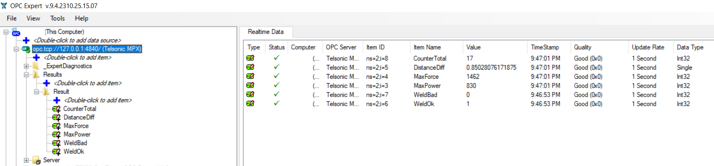

# Telsonic MPX OPC-UA Server Simulator

This repository contains a Python-based OPC-UA server simulation for a Telsonic MPX machine. The server is designed to mimic the behavior of a Telsonic MPX machine through OPC-UA variables related to power, force, distance, and weld quality indicators.

## Overview

The OPC-UA server in this repository simulates the functionality of a Telsonic MPX machine, enabling users to interact with OPC-UA variables that represent parameters such as power, force, distance, and weld quality.

## Features

- **User Authentication:** Utilizes a user management system for session handling and authentication.
- **Random Values Generation:** Simulates data by generating random values for machine parameters.
- **OPC-UA Modeling:** Defines writable OPC-UA variables for representing machine-specific parameters.
- **Command-line Interaction:** Allows users to trigger updates to OPC-UA variables via a command-line interface.
